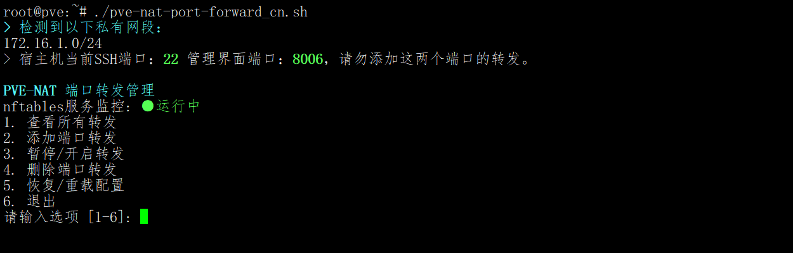
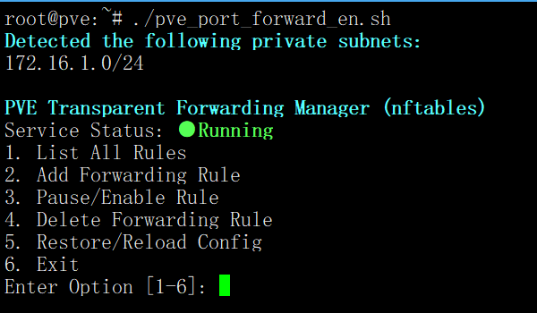

# Proxmox VE/PVE Nftables Transparent Port Forwarding Manager

# Proxmox VE/PVE Nftables 透明端口转发管理脚本

This script provides a menu-driven interface to manage `nftables` port forwarding rules on Proxmox VE. It is designed to be **transparent**, meaning it preserves the original client source IP address when forwarding traffic to backend VMs/Containers.

本脚本提供了一个基于菜单的界面，用于在 Proxmox VE 上管理 `nftables` 端口转发规则。其设计核心为**透明转发**，即在将流量转发到后端虚拟机/容器时，能够**保留客户端的原始源 IP 地址**。

---

**中文脚本截图：**



**English Script Screenshot:**



---

## 🇨🇳 中文说明 (Chinese)

### 💡 为什么使用此脚本？(解决的痛点)

1. **解决“源 IP 丢失”问题(端口转发获取 源IP/真实IP)**：
* **传统痛点**：普通的 NAT/端口转发（如 PVE 自带的防火墙或简单的 iptables SNAT）通常会将流量伪装成宿主机的 IP。这意味着后端应用（如 Nginx、Web 服务、游戏服）的日志里只能看到宿主机的内网 IP，无法获取访问者的真实 IP，导致无法进行基于 IP 的风控或统计。
* **本脚本方案**：使用 DNAT 模式而不做 SNAT，数据包携带原始 IP 直达后端，彻底解决此问题。

2. **告别“管理混乱”**：
* **传统痛点**：手动修改 `/etc/network/interfaces`、`iptables` 命令或分散的配置文件非常容易出错，时间久了很难记住开了哪些端口，甚至导致规则冲突。
* **本脚本方案**：通过统一的数据库文件管理，提供可视化的列表视图，自动排查端口冲突，增删改查一目了然。

### 📌 功能特点

* **保留源 IP (核心功能)**：不做 SNAT (Masquerade)，后端服务可以直接获取访问者的真实 IP，而非宿主机的 IP。
* **单 IP 架构优化**：专为**单公网 IP** 的 PVE 服务器设计，完美解决虚拟机服务对外暴露的问题。
* **零依赖/无需 Proxy Protocol**：完全使用系统原生 `nftables`，不依赖 Haproxy、Realm 等第三方软件，**后端业务也无需支持 Proxy Protocol 协议**。
* **智能网络识别**：自动扫描所有以 `vmbr` 开头的网桥，自动识别其下的私有子网。脚本会自动放行这些子网的虚拟机访问互联网，并允许相同子网内的虚拟机相互访问。
* **交互式菜单**：无需手动编辑配置文件，通过数字菜单即可完成增、删、改、查。
* **协议支持**：支持 TCP、UDP 或 TCP+UDP 同时转发。
* **安全白名单**：支持为每一条转发规则单独设置允许访问的源 IP（支持单 IP 或网段）。
* **冲突检测**：自动检测端口和协议冲突，防止配置错误。
* **状态管理**：支持“暂停”和“开启”规则，无需删除即可临时禁用。
* **自动备份与回滚**：添加规则前自动备份，应用失败自动回滚，降低断网风险。

### 🛠️ 环境要求与配置

* **系统**：PVE (Proxmox VE)。
* **权限**：必须以 `root` 用户或使用 `sudo` 运行。
* **配置公网接口**：脚本默认的公网网桥名称为 `vmbr0`。
    * 如果您的公网接口不是 `vmbr0`，请在运行前修改脚本**第 5 行**的 `WAN_IF` 变量。

### 🚀 快速开始

1. **下载/创建脚本**
将脚本内容保存为 `pve_port_forward_cn.sh`。

2. **赋予执行权限**
```bash
chmod +x pve_port_forward_cn.sh
```

3. **运行脚本**
```bash
./pve_port_forward_cn.sh
```

### ⚠️ 关键注意事项 (必读)

#### 1. 虚拟机网关设置 (至关重要！)

由于本脚本采用**透明转发**（不执行 SNAT/伪装），数据包到达后端虚拟机时，源 IP 仍然是外部客户端的 IP（例如 `1.2.3.4`）。

为了让后端虚拟机能正确将回包发送给客户端，**您必须将虚拟机的网关设置为宿主机的内部 IP**。

* **宿主机配置**：假设宿主机的 `vmbr0` (或您使用的内部网桥) IP 地址为 `192.168.1.1`。
* **虚拟机/容器配置**：在虚拟机的网络设置中，将 **网关 (Gateway)** 设置为 `192.168.1.1`。
* *如果虚拟机网关指向了路由器的 IP（如 192.168.1.254），转发将失败。*

#### 2. 防火墙安全与端口封禁 (特别提示)

* **宿主机防火墙依然有效**：虽然本脚本的 Input 链策略是 Accept，但这仅针对本脚本管理的表。只要您没有使用本脚本转发宿主机的某个端口，**宿主机原本的防火墙（如 PVE 数据中心防火墙）对该端口的封禁依然有效**，请放心使用。
* **安全建议**：建议在 PVE 宿主机防火墙中**封禁所有 TCP+UDP 入站端口**，仅开放必要的管理端口：
* **TCP 22** (SSH)
* **TCP 8006** (PVE Web 界面)


* **禁止操作**：**千万不要**使用本脚本转发宿主机正在使用的端口（如 22 和 8006），这会导致端口冲突，进而导致您无法连接到宿主机 SSH 或管理页面！

### 📂 文件说明

* `/etc/nat_rules.db`: 规则数据库文件（文本格式，可备份）。
* `/etc/nftables.conf`: 脚本生成的实际 nftables 配置文件（**注意：手动修改此文件会被脚本覆盖**）。

---

## 🇺🇸 English Instructions

### 💡 Why use this script? (Pain Points Solved)

1. **Solves the "Lost Source IP" Issue (Port Forwarding to Obtain Source IP/Real IP)**:

* **The Problem**: Standard NAT/Port Forwarding (like default PVE firewall or simple iptables SNAT) usually masks the traffic as coming from the Host's internal IP. Backend applications cannot see the real client IP, making IP-based logging or analytics impossible.
* **The Solution**: This script uses DNAT without SNAT. Packets arrive at the backend carrying the original client IP.

2. **Eliminates Management Chaos**:

* **The Problem**: Manually editing config files is error-prone.
* **The Solution**: Uses a unified database file with a visual menu. It automatically detects port conflicts and makes management simple.

### 📌 Features

* **Preserve Source IP (Core)**: Does not perform SNAT (Masquerade). Backend services see the real client IP.
* **Optimized for Single IP**: Ideal for PVE servers with a **single public IP**. It allows external clients to access VM services while preserving real IPs.
* **Zero Dependencies / No Proxy Protocol**: Uses native `nftables`. No 3rd party tools (Haproxy, Realm) required. **Backend services do NOT need to support Proxy Protocol.**
* **Smart Network Detection**: Automatically scans all network bridges starting with `vmbr` to identify associated private subnets. The script automatically grants internet access to VMs in these subnets and allows VMs within the same subnet to communicate with each other.
* **Interactive Menu**: Manage rules (Add, List, Pause, Delete) via a CLI menu.
* **Protocol Support**: Supports TCP, UDP, or both simultaneously.
* **Access Whitelist**: Define allowed source IPs (single IP or CIDR subnet) for each forwarding rule.
* **Conflict Detection**: Prevents port and protocol conflicts automatically.
* **State Management**: Pause and enable rules without deleting them.
* **Auto Backup & Rollback**: Backs up configuration before adding rules and rolls back automatically if application fails.

### 🛠️ Prerequisites & Configuration

* **System**: PVE (Proxmox VE).
* **Privileges**: Must be run as `root` or via `sudo`.
* **Public Interface**: The script defaults to `vmbr0`.
* If your public interface is not `vmbr0`, please edit the `WAN_IF` variable on **Line 5** of the script before running.


### 🚀 Quick Start

1. **Download/Create Script**
Save the script content as `pve_port_forward_en.sh`.

2. **Make Executable**
```bash
chmod +x pve_port_forward_en.sh
```

3. **Run Script**
```bash
./pve_port_forward_en.sh
```

### ⚠️ Important Notes (Must Read)

#### 1. VM Gateway Configuration (Critical!)

Because this script uses **Transparent Forwarding** (No SNAT), packets arrive at the backend VM with the original external client IP.

For the backend VM to send the return traffic back to the client correctly, **you must set the VM's Default Gateway to the Host's IP address.**

* **Host Configuration**: Assume your Host's bridge interface (e.g., `vmbr0`) IP is `192.168.1.1`.
* **VM/Container Configuration**: Set the **Gateway** to `192.168.1.1` (The Host's IP).
* *If the VM's gateway is set to your router (e.g., 192.168.1.254), forwarding will fail.*

#### 2. Firewall Security & Port Blocking

* **Host Firewall Coexistence**: Although this script sets its own table input policy to Accept, **your standard Host Firewall (e.g., PVE Datacenter Firewall) remains effective** for any port NOT forwarded by this script.
* **Security Recommendation**: It is recommended to block **ALL TCP+UDP ingress ports** on your Host Firewall, opening only essential management ports:
* **TCP 22** (SSH)
* **TCP 8006** (PVE Web UI)


* **CRITICAL WARNING**: **Do NOT** use this script to forward ports currently used by the Host (specifically 22 and 8006). Doing so will cause a conflict and **lock you out** of your server!

### 📂 File Structure

* `/etc/nat_rules.db`: The rules database.
* `/etc/nftables.conf`: The actual configuration file generated by the script (**Note: Manual edits to this file will be overwritten**).
